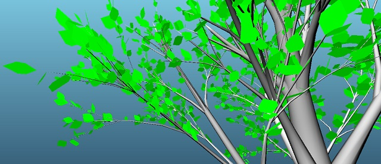
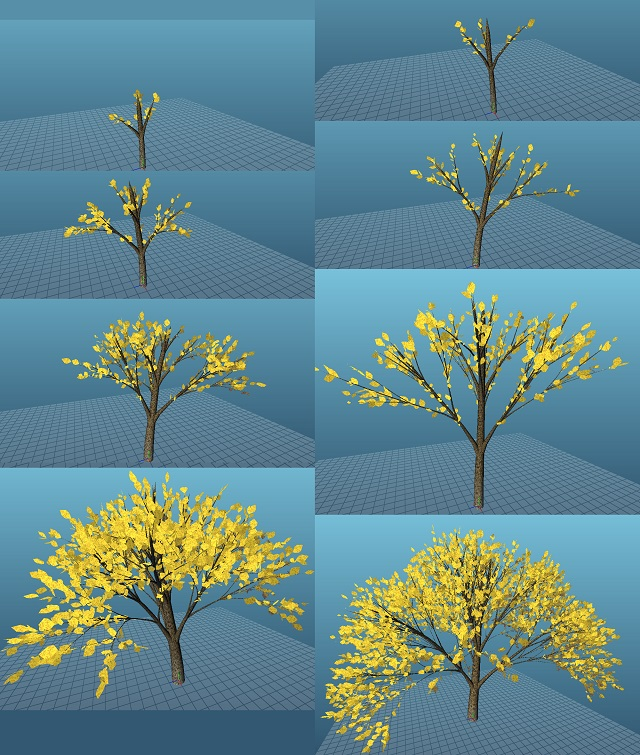

# A tree generator in OpenGL using Lindenmayer systems and turtle graphics

Created by Denny Lindberg for the course TNM084: Procedural Methods for Images.

# Features

- C++17
- For Windows (Visual Studio 2017)
- OpenGL 3.3

- Full scene with camera turntable
- Generates trees with continuous branches
- Plenty of leaves
- Only procedural content, no existing textures

# Intentionally missing
- No multi-threading
- No instancing

# Building the code

Get **premake5** for generating makefiles or solutions for your IDE - https://premake.github.io/download.html

After downloading the executable, place it in the root folder. Run `premake5 vs2017` in the terminal or command line to generate a Visual Studio 2017 solution (the solution ends up in the temp folder). Open the solution and you're good to go.

# Third party libraries used

**glad** for OpenGL bindings - https://github.com/Dav1dde/glad

**SDL2** for creating a cross-platform OpenGL window with input - https://www.libsdl.org

**glm** for vector and matrix data types compatible with OpenGL - https://glm.g-truc.net/0.9.9/index.html

**lodepng** for loading and saving PNG files - https://lodev.org/lodepng/

**tangrams glmTool** for generating hull around vertices - https://github.com/tangrams/glmTools

# Algorithms copied or referenced
**Various GLSL noise algorithms** - Copied: https://gist.github.com/patriciogonzalezvivo/670c22f3966e662d2f83

**Bresenham line drawing algorithm** - Referenced: https://rosettacode.org/wiki/Bitmap/Bresenham%27s_line_algorithm#C.2B.2B

**Evan's grid shader** - Slightly modified: http://madebyevan.com/shaders/grid/

## Folder structure

**binaries/** - contains compiled executable, dlls, images, configs or audio. (screenshots end up here)

**content/** - shader files.

**include/** - thirdparty includes.

**libs/** - windows specific libs.

**source/** - main folder for source code.

**temp/** - this folder is generated by premake5 and contains the solution. This folder can be deleted at any time.